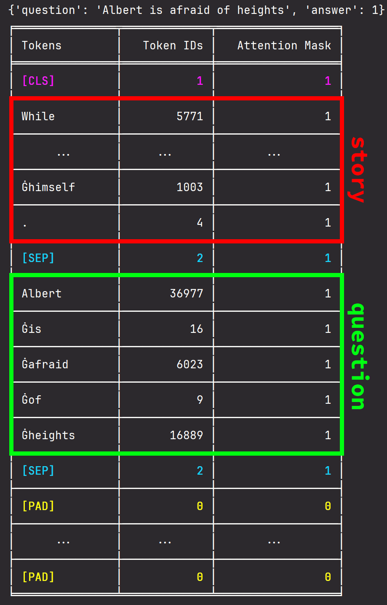
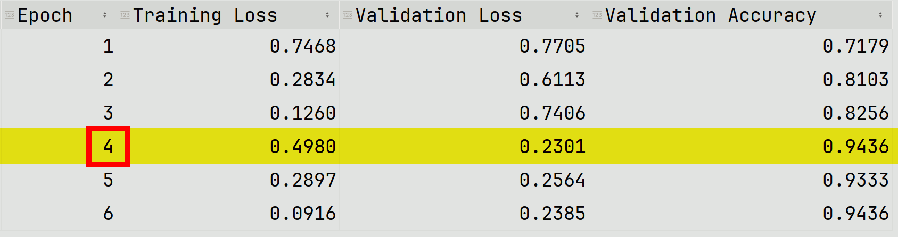
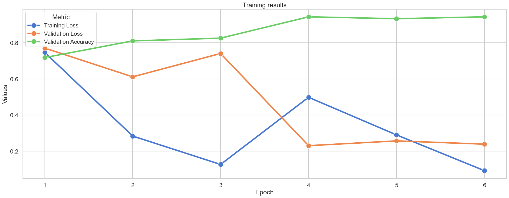
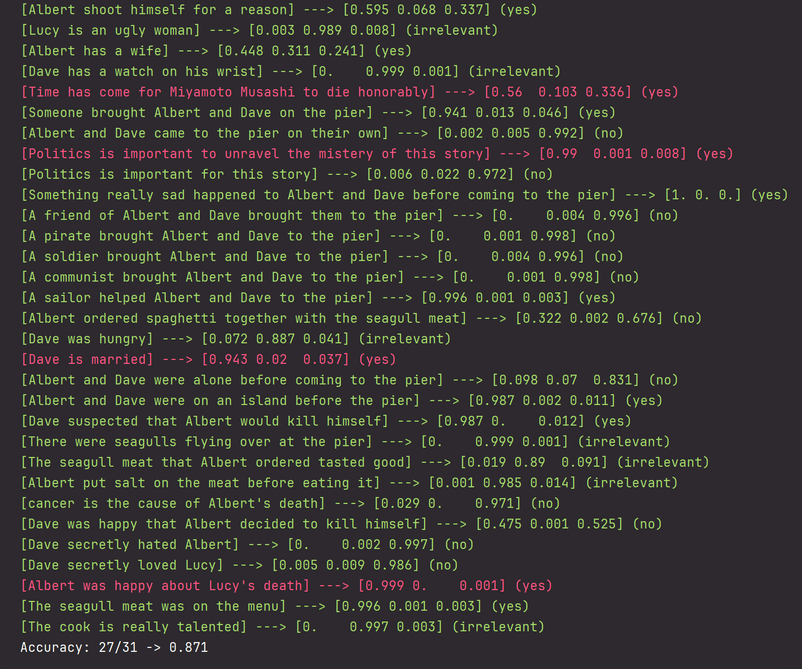

# The Seagull Story


<p align="center">
  
</p>

### [📙 Read the thesis `[PDF]`.](https://github.com/user-attachments/files/18299090/The_Seagull_Story.pdf)


Based on the idea and data set of [SeagullStory](https://github.com/manuu1311/SeagullStory) by [@manuu1311](https://github.com/manuu1311)

In this project, we aim to fine-tune a BERT-like transformer to solve a Natural Language Inference task. Based on a given story, the model is asked `yes`/`no` questions and has to answer `yes`, `no`, or `irrelevant`.

### [🙂 Hugging Face model.](https://huggingface.co/MrPio/TheSeagullStory-nli-deberta-v3-base)

### [⚡ Now deployed with Gradio.](https://huggingface.co/spaces/MrPio/TheSeagullStory) Help improve the model by providing feedback on incorrect predictions!


## The NLI task
*Natural Language Inference*, also known as *textual entailment*, is the task of determining whether a *hypothesis* is true (**entailment**), false (**contradiction**), or undetermined (**neutral**) given a *premise*.

In more precise terms, the *premise* $p$ entails the *hypothesis* $h$ ($p \implies h$) if and only if, typically, a human reading $p$ would be justified in inferring the proposition expressed by $h$ from the proposition expressed by $p$. This is a more relaxed definition than the pure *logical entailment*. The **relation is directional** because even if $p \implies h$, the reverse $h \implies p$ is much less certain.

Determining whether this relationship holds is an informal task, one which sometimes overlaps with the formal tasks of formal semantics. In this context, however, we want to tackle this task **using a BERT-like transformer**, which is now state-of-the-art for all kinds of NLP tasks.

Read more on [Textual entailment][1].

[1]:https://en.wikipedia.org/wiki/Textual_entailment

## BERT
Due to their innovative architectures, the BERT and GPT models have come to the fore when it comes to solving natural language tasks. Both are based on the transformer architecture, which is based on the attention mechanism, discovered by Google in 2017 and published in the paper [Attention is All You Need](https://arxiv.org/abs/1706.03762) by Vaswani et al.

### The BERT's pre-training phase
Unlike GPT, BERT is trained both to predict missing words in text (*Masked Language Modelling*), using both left and right contexts, and to recognize when two sentences in the same corpus follow each other (*Next Sentence Prediction*). 

* In the first task, each token in the input sequence is selected with a probability of $15\%$, and each selected token is replaced with the special `[MASK]` token with a probability of $80\%$, with a random token with a probability of $10\%$, and left unchanged with a probability of $10\%$. Replacement with random tokens, with a uniform probability distribution across the dictionary, is one way to fight *dataset shift*, a problem that occurs when the distribution of tokens differs greatly from training to induction. Finally, the output vector at the position of the `[MASK]` token is fed into a simple classification head, namely a feed-forward network, and then a softmax function is applied to transform the logits into a valid probability distribution over the tokens of the dictionary.
* In the second task, the transformer is fed with a vector structured as follows:
  
$$\text{\textbf{input}} = [\text{\texttt{[CLS]}} | \text{\textbf{sentence}}_1 | \texttt{[SEP]} | \text{\textbf{sentence}}_2 | \text{\texttt{[SEP]}}]$$
  
The output vector at the position of the `[CLS]` special token is processed by a binary classifier, again, a feed-forward network, to answer with a probability distribution over the classes `IsNext` and `NotNext`.

### BERT is encoder-only and bidirectional
It's interesting to note that BERT is an **encoder-only architecture**, meaning that, unlike GPT or a vanilla transformer in general, it lacks the ability to decode a vector from the dense latent space back into the vocabulary domain. Instead, BERT focuses on understanding the meaning of the input text. In the two training scenarios described above, **the classification head can be thought of as a simple one-stage decoder**, but when fine-tuning the model for a specific task, it's usually the case to remove it and add a new one based on the needs of the context.

The pre-training process implies that **BERT is a bidirectional model**, and thus is superior for tasks that require understanding the context and nuances of language. In other words, BERT is better suited to tackle our task.

### The BERT embedding strategy
Downstream of the *WordPiece* tokenizer, which uses a dictionary of $30.000$ tokens organized with a subword strategy, BERT embeds the tokens in a peculiar way.

$$E(\vec{v})=\text{LayerNorm}(\text{TokenType}(\vec{v})+\text{Position}(\vec{v})+\text{SegmentType}(\vec{v})) $$

* The $\text{TokenType}$ is the classic embedding. The one-hot encoded $(30.000\times 1)$ token is translated to a lower dimensional dense space, resulting in a smaller $(768\times 1)$ vector, where each dimension has a specific semantic meaning, but still ignores the context of the sentence.
* The $\text{Position}$ holds the information of the position of the token inside the sentence. For this purpose, $sin$ and $cos$ functions are used because they are continuous and differentiable and the relationship $sin(a+b)=f(sin(a),sin(b),cos(a),cos(b))$ allows to infer the relative position of two distinct tokens. More precisely, the value of the j-th dimension of the i-th embedded position:

$$
\mathrm{Position}(i)_j = \begin{cases}
    sin\left( \dfrac{i}{10.000^{j/768}} \right) & \text{if } i \text{ is even} \\
    cos\left( \dfrac{i}{10.000^{j/768}} \right)  & \text{if } i \text{ is odd.}
\end{cases}
$$

  This means that large dimensions encode large positional differences, while smaller dimensions encode finer positional differences.
* The $\text{SegmentType}$ is used for the *Next Sentence Prediction* training. It simply assigns a binary label based on which sentence the token belongs to. Essentially it is $\vec{0}$ if the token comes before the `[SEP]` special token, or $\vec{1}$ if it comes after it.

Read more on [Differences Between GPT and BERT][2] and [BERT Model – NLP][3].

## The choice of a BERT-like model
Over the years, several papers have been published proposing deviations from the original BERT model, both in the *pre-training process* and in the *model architecture*.

### Base models
The most downloaded models on [*HuggingFace*](https://huggingface.co/) are: 

* Facebook devised *RoBERTa*, which increased by ten times the size of the training set and introduced eight times larger mini-batches. This results often with better performance than the original BERT. *RoBERTa* removed the *Next Sentence Prediction* loss from the pre-training phase. Empirically, it was proven that this slightly improves downstream task performance.
* *ALBERT* is a light version of BERT optimized for tasks with limited computational resources. Its main aim is to reduce the number of parameters, i.e. the complexity of the model, in favour of faster fine-tuning and inference. For this purpose, *ALBERT* adds the *cross-layer parameter sharing* and *reduction*, a factorizing technique. While the former is rather intuitive, the latter reduces the embedding size to $128$ while leacing the size of the hidden layers unchanged.
* *ELECTRA* introduces *Replace Token Detection Technique* as a replacement for the BERT's *Masked Language Modelling* pre-training task. Instead of using the `[MASK]` special token, the tokens are replaced by alternative samples. This is done using a *generator-discriminator* configuration.
* Much like *ALBERT*, *DistilBERT* aims to reduce the model's complexity, but it does so with a different approach. *DistilBERT* implements *knowledge distillation* using a *teacher-student* framework. It goes without saying that *DistilBERT* sacrifices some accuracy.

Read more on  [BERT Variants and their Differences][4].

### Specialized models
All the BERT-like models discussed so far, has a lot in common with the original BERT model. In 2020, Microsoft released the paper [*DeBERTa: Decoding-enhanced BERT with Disentangled Attention*](https://arxiv.org/abs/2006.03654), introducing a BERT-like model with rather groundbreaking news.

*DeBERTa* improves *RoBERTa* with *disentangled attention* and an *enhanced mask decoder*. *Disentangled attention* differs from the classical *self-attention* in that the *content* of a token is evaluated along with its *relative position*, rather than summing its embedding into a single aggregated vector, as BERT does. This implies that *DeBERTa* uses two vectors to encode each token.

Moreover, since its 3rd version, *DeBERTa* has adopted the *ELECTRA* pre-training style.

Given the superior performance of *DeBERTa* over the other BERT-like models, we chose it to solve our *NLI* problem.

Read more on  [BERT Variants and their Differences][4].

[2]:https://www.geeksforgeeks.org/differences-between-gpt-and-bert/
[3]:https://www.geeksforgeeks.org/explanation-of-bert-model-nlp
[4]:https://360digitmg.com/blog/bert-variants-and-their-differences

## Fine-tuning a fine-tuned model: nli-deberta-v3-base

Choosing *DeBERTa* isn't enough. The vanilla *DeBERTa* model is [`microsoft/deberta-v3-base`](https://huggingface.co/microsoft/deberta-v3-base) and, much like *BERT*, it can be fine-tuned on different kinds of NLP tasks. However, all training using this model has been unsuccessful in our case. This is probably due to the limited size and quality of our training set.

A better approach was to fine-tune a model more specialized to the NLI task. [`cross-encoder/nli-deberta-v3-base`](https://huggingface.co/cross-encoder/nli-deberta-v3-base) is the result of fine-tuning the original *DeBERTa* model to *SNLI* and *MultiNLI*, which are the state-of-the-art data sets in the NLI task.

### Writing the story
As we discussed in the previous section, each input to the model will be structured as follows.

$$\text{\textbf{input}} = [\text{\texttt{[CLS]}} | \text{\textbf{story}} | \texttt{[SEP]} | \text{\textbf{question}} | \text{\texttt{[SEP]}}]$$

Thus, each question is tokenized along with the entire story at each inference.

#### The problem of dealing with multiple contexts
The story is subdivided into 4 distinct phases:
- *The boat voyage.* Albert, Dave and Lucy enjoying their boating vacation.
- *The desert island.* A shipwreck has caused Lucy's death. Albert and Dave struggle to survive on a deserted island with no food sources.
- *The rescue.* A passing sailor sees Albert and Dave and rescues them from the island.
- *The pier.*  Albert insists on going to the restaurant, orders seagull meat and shoots himself.

The problem arises when the user asks a question whose answer depends on the phase. For instance, if the user says "Albert wants to kill himself", the answer is `yes` in the last context, but not in the previous ones.

[@manuu1311](https://github.com/manuu1311)'s strategy to overcome this problem is to allow the user to choose between multiple contexts before asking a question.

We took a different approach: we avoided asking the user to specify a context, instead trusting him to clearly specify the point in time to which he is referring in his question. This choice is reflected in the dataset, each sentence specify the period of the story, such as "On the island..." or "At the restaurant...". Since the context is a constant, this also allowed us to structure the data set as a simple list of sentences, rather than a `.json` file with a mostly redundant *context* field for each sample.

#### Choosing the right context size
In the original *DeBERTa* model, the context size, i.e. the maximum number of tokens an inference pass can handle in each of its inputs, is $512$. This number depends on the *positional embeddings*. As we discussed earlier, one of the three embedding components in BERT models encodes the position of the tokens to account for their location within the sentence.

The embeddings can be expanded using *interpolation* or *initialization* techniques. Interpolation is useful for smooth expansion. Alternatively, the new embeddings can be randomly initialized. Either way, after the embeddings are extended, the model needs to be fine-tuned for subsequent tasks.

We managed to fit the whole story, stored in [`story.txt`](/dataset/story.txt), into less than $512$ tokens, $427$ tokens. That leaves $82$ tokens for the question, taking into account the `[CLS]` and the two `[SEP]` tokens. Considering the size of $128.001$ tokens of the vocabulary used by the tokenizer of DeBERTa, $82$ tokens gives enough space to encode any question.

Therefore, we avoided expanding the context size and thus hindering the model's performance. The overall tokenization is structured as shown in the figure below.

<p align="center">
  
</p>

In the *GPT2* and *RoBERTa* tokenizers, the space before a word is part of the word. The *Ġ* symbol is a convention to indicate that space. *DeBERTa* also adopts this convention, since it is a specialized version of *RoBERTa*.

Read more on  [BPE tokenizers and spaces before words][5].

[5]:https://discuss.huggingface.co/t/bpe-tokenizers-and-spaces-before-words/475

### The structure of the data set
Starting from the data set of [SeagullStory](https://github.com/manuu1311/SeagullStory) by [@manuu1311](https://github.com/manuu1311), we extracted all the questions stored in the different `.json` files, cleaned them up and organized them into three different `.txt` files, namely [`yes.txt`](dataset/yes.txt), [`irrelevant.txt`](dataset/irrelevant.txt) and [`no.txt`](dataset/no.txt), each containing the list of questions of one of the three classes, separated by a new line. Up to this point we had about 150 samples for each class.

We further enriched the dataset by manually adding samples until we reached $250$ samples for each class. Then, as a data enrichment strategy, we asked the `gpt-4o` and `gemini-2.0-flash-exp` LLMs to provide more samples based on the story. This gave us $650$ samples per class, for a total of $1.950$ samples, unfortunately with a small percentage of duplicates that we left **to avoid class imbalance**. These $1.950$ samples are randomly shuffled and the $10\%$ of them are chosen as the test set.

### Fine-tuning the model
Using the handy `TrainingArguments`, `Trainer` classes from the `transformers` library, which leverage *Keras* to expose a high-level interface for training, the `cross-encoder/nli-deberta-v3-base` has been trained for $6$ epochs, with a batch size of $8$ and learning rate of $2\times 10^{-5}$. 

#### The results
The training took **4 hours and 34 minutes** on a *GeForce RTX 3070 Laptop* GPU, having 8GB of dedicated VRAM. The results of the training are shown below.

<p align="center">
  
</p>

The graph below shows that the best epoch is the 4th.

<p align="center">
  
</p>

Since the test set is not completely independent of the training set due to the slight redundancy in the data set, a final set was run with completely new samples. The model correctly guesses 27 out of 31 questions, as can be seen below.

<p align="center">
  
</p>

#### Enhancing the performance
The model can be further refined with a lower learning rater to account for questions that are still answered incorrectly. This is left for future work. However, the reader should note that in order to mitigate the effect of *catastrophic forgetting*, an inherent problem of MLP networks, samples from the original datasets should be considered along with the new ones.

Another thing we could do is start over with the model [`cross-encoder/nli-deberta-v3-large`](https://huggingface.co/cross-encoder/nli-deberta-v3-large), which has 435 million of parameters, $2.36$ times more than [`cross-encoder/nli-deberta-v3-base`](https://huggingface.co/cross-encoder/nli-deberta-v3-base).

### Deployment
Finally, the model was [uploaded to HuggingFace](https://huggingface.co/MrPio/TheSeagullStory-nli-deberta-v3-base) and [deployed to a dedicated Space using Gradio SDK](https://huggingface.co/spaces/MrPio/TheSeagullStory).
Using Gradio SDK, **a flagging system has been implemented** to allow users to extend the dataset with incorrectly predicted questions.

<p align="center">
  
</p>

Since HuggingFace's Spaces service's free plan doesn't include persistent storage, we rely on [*Firebase Firestore*](https://firebase.google.com/docs/firestore) to store users' feedback. The credentials are not exposed in the code, but injected through the apposite "secrets" setting provided by HuggingFace. Therefore, the script running inside a Docker container retrieves the Firestore's private key from the environment variables.

<p align="center">
  
</p>

This is achieved by employing the following custom implementation of the abstract `FlaggingCallback` class. The entire code can be seen at [`app.py`](https://huggingface.co/spaces/MrPio/TheSeagullStory/blob/main/app.py).

```python
class Flagger(FlaggingCallback):
    def __init__(self):
        self.base_logger = CSVLogger()
        self.flags_collection = db.collection(".../seagull_story_flags")

    def setup(self, components: Sequence[Component], flagging_dir: str):
        self.base_logger.setup(components=components, flagging_dir=flagging_dir)

    def flag(self, flag_data: list[Any], flag_option: str | None = None, username: str | None = None) -> int:
        if len(flag_data[0]) > 3 and 'confidences' in flag_data[1]:
            self.flags_collection.document(str(time.time_ns())).set({
                "question": flag_data[0],
                "prediction": flag_data[1]['label'],
                "confidences": flag_data[1]['confidences'],
                "flag": flag_option,
                "timestamp": datetime.now(pytz.utc),
                "username": username,
            })
        return self.base_logger.flag(flag_data=flag_data, flag_option=flag_option, username=username)
```

Moreover, the `cross-encoder/nli-deberta-v3-base` model has an excessive floating-point precision of 32 bits. We used PyTorch’s `half()` function to convert the parameters to 16 bits before deployment, and thus halve the size down to 369Mb.
